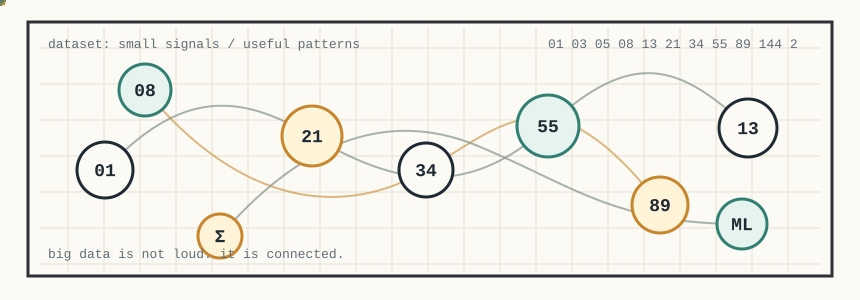

  
   
  

 

`Big Data` · `Machine Learning` · `Python` · `Math Modeling`

I like clean data, small models, readable notebooks, and the quiet moment when numbers begin to explain themselves.

 

  

 

  

